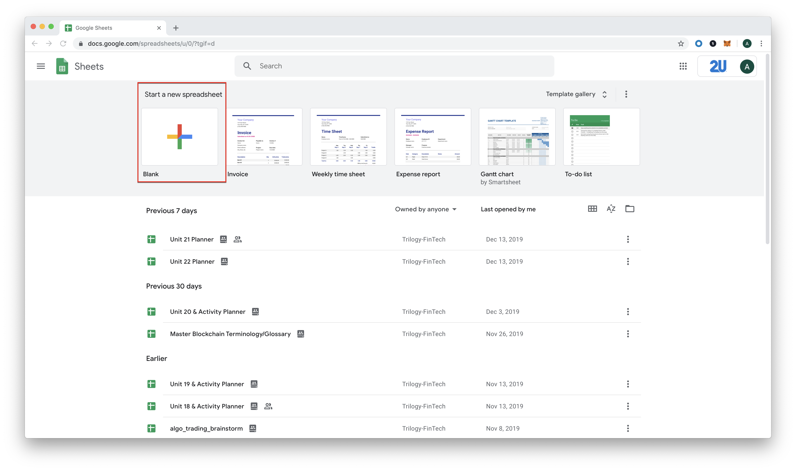
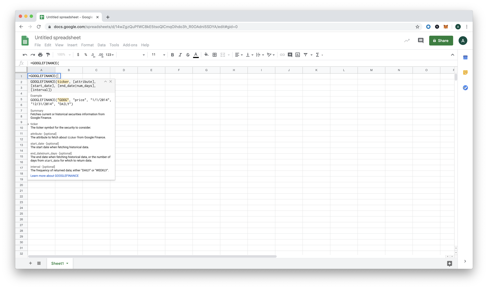
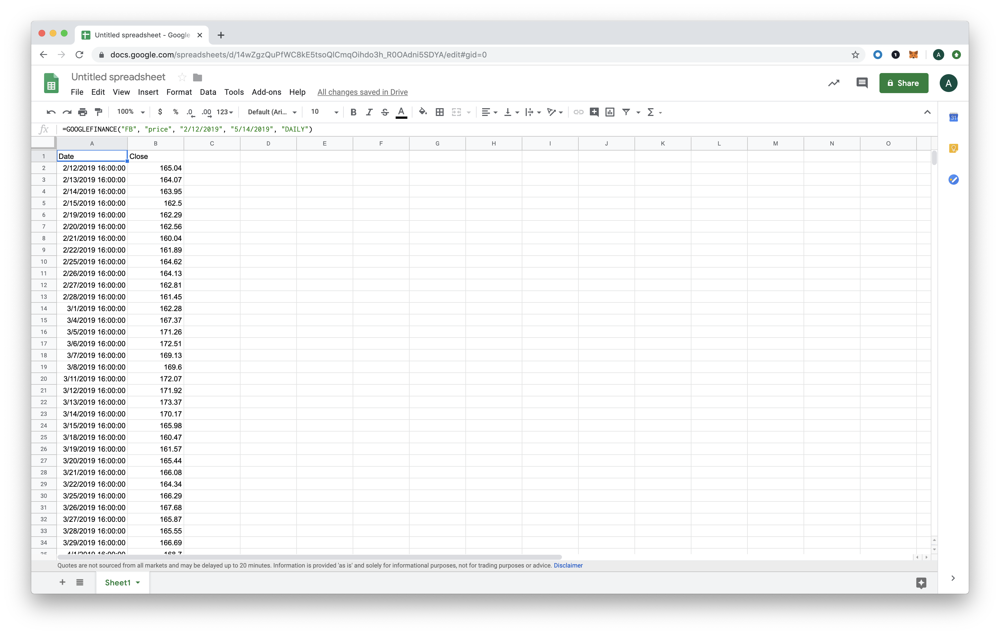
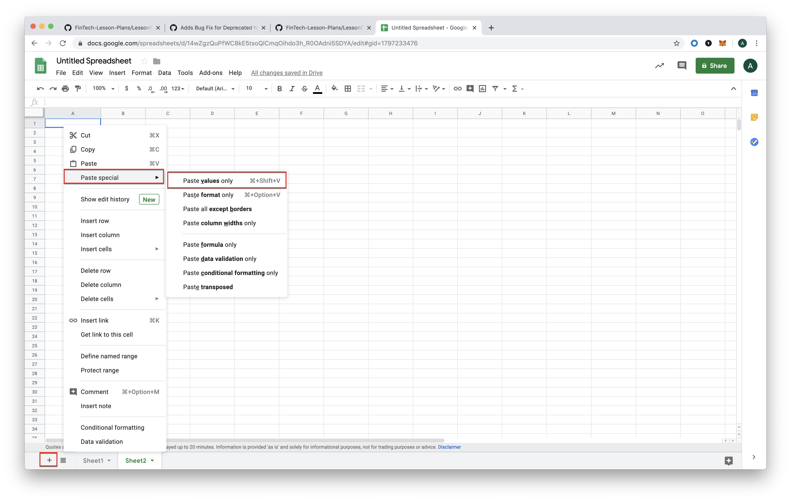
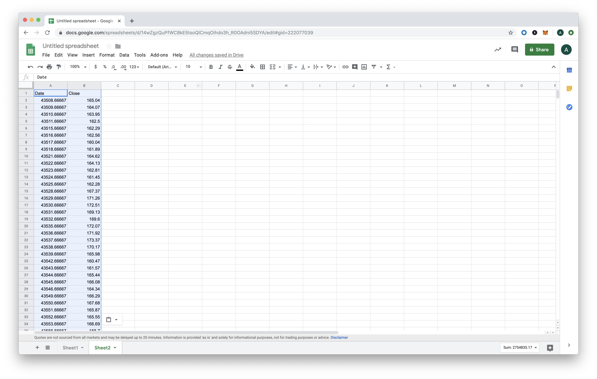
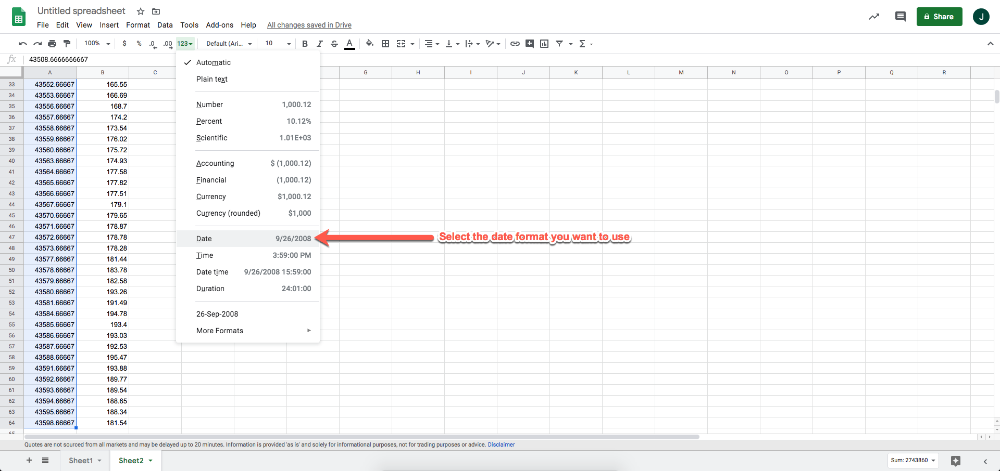
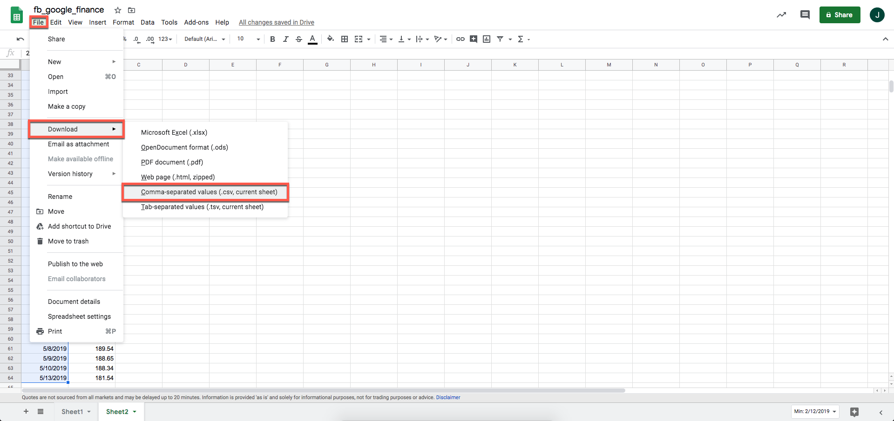

# Fetching Stock Data Using Google Sheets

Google Sheets offers a mechanism to fetch stock data. This feature is quite handy when you are prototyping portfolios or performing stock data analysis. You can retrieve data from the major indexes such as the S&P 500, NYSE, NASDAQ, and the S&P TSX 60.

This guide will show you how to extract historical stock ticker data from Google Sheets via [the Google Finance function](https://support.google.com/docs/answer/3093281) as a CSV.

Using Google Sheets with the built-in Google Finance function, you can leverage historical stock data to keep a running tab on daily returns for specific stocks.

To start using this feature of Google Sheets, follow the next steps:

* Navigate to the [Google Sheets](https://docs.google.com/spreadsheets/) website. Then open a new spreadsheet.

  

* Use the `GOOGLEFINANCE` built-in function to extract historical stock data from within Google Sheets. The function takes in five input parameters:

  

  * `ticker`: The ticker symbol for the security to consider.

    * `"TSE:SHOP"` will fetch Shopify stock data from the Toronto Stack Exchange (S&P/TSX 60 Index).

    * `"NASDAQ:GOOG"` will fetch Google stock data from NASDAQ.

    * `"NYSE:DIS"` will fetch stock data from The Walt Disney Company.

  * `attribute`: The attribute to fetch about `ticker` from Google Finance.

  * `start_date`: The start date when fetching historical data.

  * `end_date`: The end date when fetching historical data, or the number of days from `start_date` for which to return data.

  * `interval`: The frequency of returned data; either "DAILY" or "WEEKLY."

  **Note:** The `end_date` provides historical data up to but not including the date specified.

* Type in the following for the Google Finance function: `=GOOGLEFINANCE("FB", "price", "2/12/2019", "5/14/2019", "DAILY")`. The data should populate within the Google Sheet.

  

* Then, create a new Google Sheet tab and copy and paste the historical stock data into the new tab. Make sure to "Paste values only" otherwise, the data will not download correctly.

  

  

  **Note:** Due to the copy and paste of values only, the date values will be represented in numerical format. Therefore, they will have to be re-formatted as date values after downloading the CSV file.

* To format the numerical date values in proper date format, select all the values from the `Date` column, next, click on the "More formats" icon in the toolbar to choose the date format you want to use.

  

* Rename the file as `fb_google_finance` and then download and save the file as a CSV. Make sure to reside in the second tab where the hard-pasted values are contained.

  

  **Note:** The downloaded file may have to be renamed again as Google Sheets appends the current sheet name to the file, for example, `fb_google_finance - Sheet2.csv`.

* The general process for extracting Google Finance data from within Google Sheets and downloading as a CSV is shown below.

  

Now you can use your brand new CSV file to perform stock analysis with Python and Pandas!

---

© 2020 Trilogy Education Services, a 2U, Inc. brand. All Rights Reserved.
